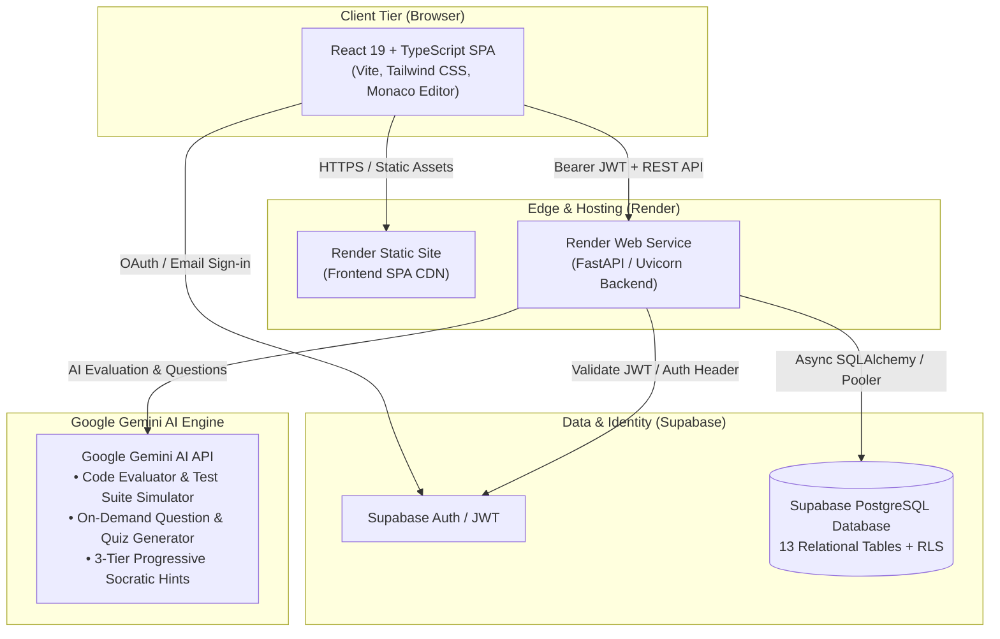
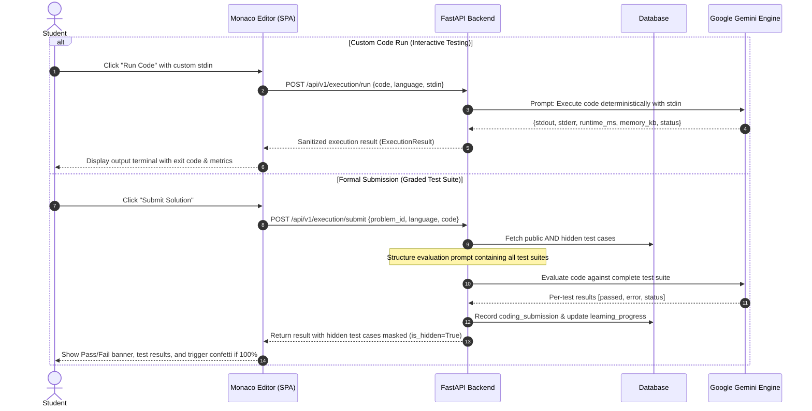
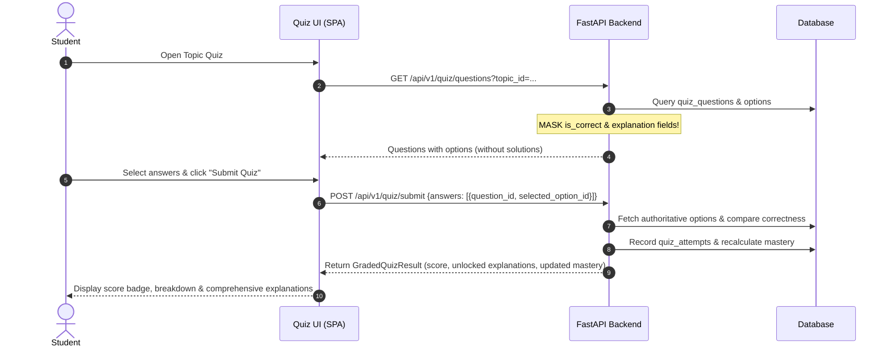
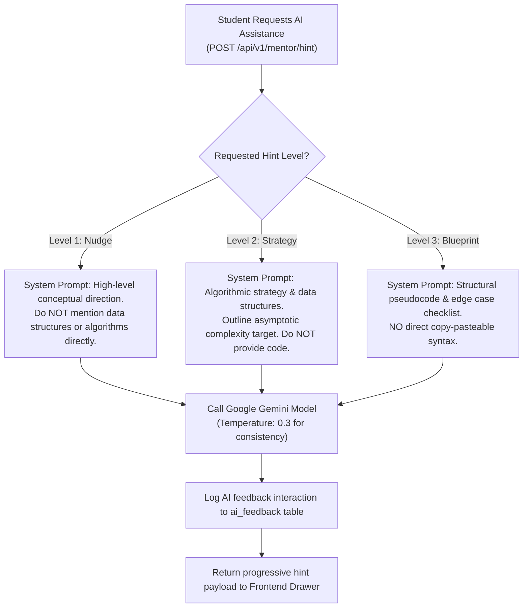

# Cognitio Libera — System Architecture 🏗️

> **Practice. Understand. Improve.**  
> An AI-powered coding practice, programming quiz, technical interview preparation, and personalized learning platform.

---

## 1. High-Level System Overview

Cognitio Libera is built as a modern, decoupled full-stack platform consisting of a responsive Single Page Application (SPA), an asynchronous RESTful API backend, a Supabase PostgreSQL persistence layer, and an AI evaluation and mentoring engine powered exclusively by Google Gemini.

---

## 2. Technology Stack & Component Responsibilities

| Tier | Technology | Key Libraries / Modules | Primary Responsibility |
| :--- | :--- | :--- | :--- |
| **Frontend** | React 19, TypeScript, Vite | Monaco Editor (`@monaco-editor/react`), Lucide React, Canvas Confetti | User experience, live coding editor, quiz interactivity, active ticking timers, and real-time feedback rendering. |
| **Styling** | Tailwind CSS v4 | Curated Indigo/Slate palette, custom glassmorphic cards, light/dark theme engine | UI kit visual fidelity matching the Figma design specifications. |
| **Backend API** | Python 3.9+, FastAPI | Pydantic v2, SQLAlchemy 2.0, Uvicorn, AnyIO, HTTPX | Authentication validation, business logic, test harness injection, answer masking, and progress computation. |
| **Database** | PostgreSQL (Supabase) / SQLite | Async session handling, connection pooling, RLS policies | Relational persistence for profiles, problems, test suites, quizzes, attempts, and AI feedback history. |
| **Code Execution** | Google Gemini AI Evaluator | Structured JSON test harness & prompt simulation | Sandboxed execution simulation across Python, JS, C++, and Java with syntax checking and test assertion. |
| **AI Intelligence** | Google Gemini API | `google.generativeai` (Gemini 1.5 / 2.5) | Conceptual hinting (3 progressive levels), code reviews, dynamic question generation, and dual-verification. |

---

## 3. Core Architectural Data Flows

### 3.1. Code Execution Flow (Run vs. Submit via Gemini)

### 3.2. Quiz Attempt & Anti-Cheat Grading Flow

To prevent inspection in browser DevTools:
1. When fetching quiz questions via `GET /api/v1/quiz/questions`, the API schemas strip `is_correct` and `explanation` from options.
2. The user answers questions in the client and submits them via `POST /api/v1/quiz/submit`.
3. The server validates answers against the authoritative database, records the `quiz_attempts`, updates the user's topic mastery in `learning_progress`, and returns the graded attempt with unlocked explanations and earned points.

### 3.3. AI Mentor Flow (Progressive Hints & Socratic Tutoring)

The AI Mentor is designed to guide the student without revealing the solution directly.

---

## 4. Content Generation & Dual-Verification Pipeline

When administrators or background jobs generate new coding problems or quiz questions:

1. **Generation**: `GeminiContentGenerator` receives a topic and target difficulty, crafting a complete problem specification with problem statements, starter codes in multiple languages, constraints, and test cases.
2. **Verification**: `GeminiContentVerifier` runs an independent verification pass checking for:
   - Ambiguity in the problem statement
   - Input format mismatches between starter code and test cases
   - Edge case coverage (empty arrays, boundary limits, negative inputs)
   - Correctness of expected outputs
3. **Storage**: Only problems passing verification are committed to the `coding_problems` and `coding_test_cases` tables.

---

## 5. Security & Isolation Architecture

1. **No Backend `eval()` or `exec()`**: Code submitted by users is **never** evaluated on the FastAPI host. All execution simulations and test validations are handled exclusively by Google Gemini via structured JSON prompting, with offline safe AST parsing as a fallback.
2. **Hidden Test Privacy**: Hidden test cases validate edge cases (large inputs, boundary conditions). The frontend API contracts strictly omit hidden test payloads, only revealing whether the test passed or failed.
3. **Authentication Dual Mode**:
   - In production, Supabase Auth emits RS256 JWTs verified against the Supabase project public key.
   - In offline/local development, an HMAC dev token (`dev-token-...`) allows testing without third-party network dependencies.
4. **Database Connection Hardening**: SQLAlchemy uses connection pooling with pool recycle (`pool_recycle=300`) and pre-ping validation to withstand transaction pooler dropouts on cloud PostgreSQL.
