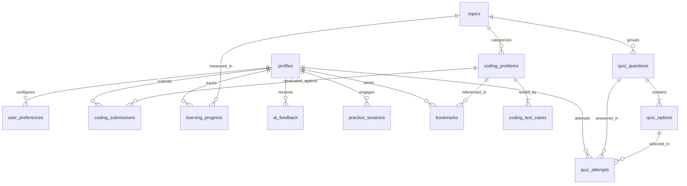

# Cognitio Libera — Database Architecture & Schema 🗄️

> **Practice. Understand. Improve.**  
> Comprehensive database documentation, entity relationship specifications, and Row Level Security (RLS) policies.

---

## 1. Overview & Dialect Strategy

Cognitio Libera is designed to work seamlessly in two operational modes:
1. **Cloud Production (Supabase PostgreSQL)**: Uses hosted PostgreSQL with PgBouncer connection pooling (`port 6543`, transaction mode) and native Supabase Auth schema integration.
2. **Local Zero-Config (SQLite)**: Automatically falls back to `sqlite:///./cognitio_libera.db` for instant offline development and automated test suites without external service dependencies.

SQLAlchemy 2.0 models utilize portable data types (`String(36)` for UUIDs, `JSON` / `Text` with cross-dialect serialization) to guarantee 100% feature parity across both database engines.

---

## 2. Entity Relationship Diagram (ERD)



---

## 3. Table Specifications

### 3.1. `profiles`
Stores student accounts, display names, points, streaks, and global rankings.
- `id` (VARCHAR(36), PK): Matches Supabase Auth user UUID.
- `email` (VARCHAR(255), UNIQUE, NOT NULL): Student email address.
- `username` (VARCHAR(100), UNIQUE, NOT NULL): Unique handle for leaderboards.
- `full_name` (VARCHAR(255), NULL): User's legal or display name.
- `avatar_url` (VARCHAR(512), NULL): Link to student profile photo.
- `role` (VARCHAR(50), DEFAULT 'student'): Role ('student', 'admin', 'moderator').
- `total_points` (INTEGER, DEFAULT 0): Gamified experience points.
- `current_streak` (INTEGER, DEFAULT 0): Consecutive practice days.
- `longest_streak` (INTEGER, DEFAULT 0): All-time highest streak.
- `last_active_at` (TIMESTAMP WITH TIME ZONE, NULL): Timestamp of most recent activity.
- `created_at` (TIMESTAMP WITH TIME ZONE, DEFAULT NOW()): Account creation time.
- `updated_at` (TIMESTAMP WITH TIME ZONE, DEFAULT NOW()): Account update time.

### 3.2. `user_preferences`
User-specific IDE and platform preferences.
- `id` (VARCHAR(36), PK): UUID.
- `user_id` (VARCHAR(36), FK -> `profiles.id`, UNIQUE): 1:1 user relation.
- `preferred_language` (VARCHAR(50), DEFAULT 'python'): Default editor language.
- `theme` (VARCHAR(20), DEFAULT 'light'): UI theme ('light' or 'dark').
- `editor_font_size` (INTEGER, DEFAULT 14): Monaco editor font size in px.
- `tab_size` (INTEGER, DEFAULT 4): Editor indentation width.
- `vim_mode` (BOOLEAN, DEFAULT FALSE): Toggle for Vim keybindings.
- `ai_verbosity` (VARCHAR(20), DEFAULT 'moderate'): AI mentor response depth.

### 3.3. `topics`
Organizes syllabus categories for both coding challenges and quizzes.
- `id` (VARCHAR(36), PK): UUID.
- `name` (VARCHAR(100), UNIQUE, NOT NULL): Topic title (e.g., "Arrays & Hashing", "Dynamic Programming").
- `slug` (VARCHAR(100), UNIQUE, NOT NULL): URL-safe identifier (e.g., "arrays-and-hashing").
- `description` (TEXT, NULL): Pedagogical description of the topic.
- `icon` (VARCHAR(50), DEFAULT 'code'): UI icon identifier.
- `category` (VARCHAR(50), DEFAULT 'dsa'): Category ('dsa', 'core_cs', 'system_design', 'web_dev').
- `order_index` (INTEGER, DEFAULT 0): Display ordering in catalogues.

### 3.4. `coding_problems`
Coding challenges tailored for LeetCode-style algorithmic practice.
- `id` (VARCHAR(36), PK): UUID.
- `title` (VARCHAR(255), NOT NULL): Problem title.
- `slug` (VARCHAR(255), UNIQUE, NOT NULL): URL-friendly route slug.
- `topic_id` (VARCHAR(36), FK -> `topics.id`): Associated topic.
- `difficulty` (VARCHAR(20), NOT NULL): 'easy', 'medium', or 'hard'.
- `description` (TEXT, NOT NULL): Markdown problem description and constraints.
- `starter_code` (JSON, NOT NULL): Dictionary mapping language names to default boilerplates.
- `time_limit_ms` (INTEGER, DEFAULT 2000): Maximum execution time ceiling.
- `memory_limit_kb` (INTEGER, DEFAULT 256000): Sandbox memory allowance.
- `order_index` (INTEGER, DEFAULT 0): Topic sequence sorting.
- `is_published` (BOOLEAN, DEFAULT TRUE): Public visibility toggle.

### 3.5. `coding_test_cases`
Visible and hidden unit tests for coding challenges.
- `id` (VARCHAR(36), PK): UUID.
- `problem_id` (VARCHAR(36), FK -> `coding_problems.id`, ON DELETE CASCADE): Target problem.
- `input` (TEXT, NOT NULL): Standard input or function parameters.
- `expected_output` (TEXT, NOT NULL): Expected standard output or return value.
- `is_hidden` (BOOLEAN, DEFAULT FALSE): Anti-cheat indicator (hidden from client payloads).
- `order_index` (INTEGER, DEFAULT 0): Execution order.
- `explanation` (TEXT, NULL): Optional hint explaining the test case logic.

### 3.6. `coding_submissions`
Records every user submission and evaluation result.
- `id` (VARCHAR(36), PK): UUID.
- `user_id` (VARCHAR(36), FK -> `profiles.id`): Submitting student.
- `problem_id` (VARCHAR(36), FK -> `coding_problems.id`): Target problem.
- `language` (VARCHAR(50), NOT NULL): Programming language submitted.
- `code` (TEXT, NOT NULL): Full source code.
- `status` (VARCHAR(50), NOT NULL): 'Accepted', 'Wrong Answer', 'Time Limit Exceeded', etc.
- `runtime_ms` (FLOAT, NULL): Execution duration.
- `memory_kb` (INTEGER, NULL): Memory consumption peak.
- `passed_test_cases` (INTEGER, DEFAULT 0): Count of passed test cases.
- `total_test_cases` (INTEGER, DEFAULT 0): Total test suite size.
- `error_message` (TEXT, NULL): Stderr or compilation diagnostic.
- `submitted_at` (TIMESTAMP WITH TIME ZONE, DEFAULT NOW()): Submission timestamp.

### 3.7. `quiz_questions` & `quiz_options`
Conceptual multiple-choice questions and selectable answers.
- **quiz_questions**: `id`, `topic_id`, `difficulty`, `question_text`, `code_snippet`, `explanation`, `order_index`.
- **quiz_options**: `id`, `question_id` (FK, CASCADE), `option_text`, `is_correct` (Masked), `order_index`.

### 3.8. `quiz_attempts`
Records student selections and grading results for quizzes.
- `id` (VARCHAR(36), PK): UUID.
- `user_id` (VARCHAR(36), FK -> `profiles.id`).
- `question_id` (VARCHAR(36), FK -> `quiz_questions.id`).
- `selected_option_id` (VARCHAR(36), FK -> `quiz_options.id`).
- `is_correct` (BOOLEAN, NOT NULL).
- `answered_at` (TIMESTAMP WITH TIME ZONE, DEFAULT NOW()).

### 3.9. `learning_progress`
Calculates per-topic and per-category student mastery levels.
- `id` (VARCHAR(36), PK): UUID.
- `user_id` (VARCHAR(36), FK -> `profiles.id`).
- `topic_id` (VARCHAR(36), FK -> `topics.id`).
- `mastery_percentage` (FLOAT, DEFAULT 0.0): Computed proficiency (0 - 100%).
- `problems_solved` (INTEGER, DEFAULT 0): Solved coding problems count.
- `quizzes_completed` (INTEGER, DEFAULT 0): Completed quiz questions count.
- `last_practiced_at` (TIMESTAMP WITH TIME ZONE, NULL): Timestamp of last practice.

### 3.10. `ai_feedback`
Persists conversations with the Gemini AI Mentor, including progressive hints and code reviews.
- `id` (VARCHAR(36), PK): UUID.
- `user_id` (VARCHAR(36), FK -> `profiles.id`).
- `problem_id` (VARCHAR(36), FK -> `coding_problems.id`, NULL).
- `feedback_type` (VARCHAR(50), NOT NULL): 'hint_level_1', 'hint_level_2', 'hint_level_3', 'code_review', 'chat'.
- `prompt_tokens` / `response_tokens` (INTEGER, NULL): Usage analytics.
- `feedback_content` (TEXT, NOT NULL): The generated mentor response.
- `created_at` (TIMESTAMP WITH TIME ZONE, DEFAULT NOW()).

---

## 4. Supabase Row Level Security (RLS) Policies

When deploying to Supabase PostgreSQL, apply the following RLS policies to safeguard multi-tenant data:

```sql
-- Enable RLS on user-specific tables
ALTER TABLE profiles ENABLE ROW LEVEL SECURITY;
ALTER TABLE user_preferences ENABLE ROW LEVEL SECURITY;
ALTER TABLE coding_submissions ENABLE ROW LEVEL SECURITY;
ALTER TABLE quiz_attempts ENABLE ROW LEVEL SECURITY;
ALTER TABLE learning_progress ENABLE ROW LEVEL SECURITY;
ALTER TABLE ai_feedback ENABLE ROW LEVEL SECURITY;

-- 1. Profiles: Public read, self-update only
CREATE POLICY "Profiles are viewable by everyone" 
ON profiles FOR SELECT USING (true);

CREATE POLICY "Users can update their own profile" 
ON profiles FOR UPDATE USING (auth.uid()::text = id);

-- 2. User Preferences: Self read and write only
CREATE POLICY "Users can view own preferences" 
ON user_preferences FOR SELECT USING (auth.uid()::text = user_id);

CREATE POLICY "Users can update own preferences" 
ON user_preferences FOR ALL USING (auth.uid()::text = user_id);

-- 3. Submissions: Self read, backend service role insert
CREATE POLICY "Users can view own submissions" 
ON coding_submissions FOR SELECT USING (auth.uid()::text = user_id);

-- 4. Public Content: Read-only for authenticated and anon users
ALTER TABLE topics ENABLE ROW LEVEL SECURITY;
ALTER TABLE coding_problems ENABLE ROW LEVEL SECURITY;
ALTER TABLE quiz_questions ENABLE ROW LEVEL SECURITY;
ALTER TABLE quiz_options ENABLE ROW LEVEL SECURITY;

CREATE POLICY "Topics are viewable by everyone" ON topics FOR SELECT USING (true);
CREATE POLICY "Problems are viewable by everyone" ON coding_problems FOR SELECT USING (is_published = true);
CREATE POLICY "Quiz questions are viewable by everyone" ON quiz_questions FOR SELECT USING (true);
CREATE POLICY "Quiz options are viewable by everyone" ON quiz_options FOR SELECT USING (true);
```

---

## 5. Seed Data & Verification

The database includes a comprehensive seed suite (`backend/app/db/seed_data.py`) featuring:
- **15 Fundamental Topics**: Spanning Arrays, Strings, Trees, Graphs, Dynamic Programming, SQL, and System Design.
- **20 Verified Coding Challenges**: With multi-language starter codes and both public and hidden test cases.
- **50 Technical MCQs**: With detailed theoretical explanations and conceptual distractors.

To re-seed or bootstrap the database locally at any time:
```bash
PYTHONPATH=backend python backend/app/db/init_db.py
```
