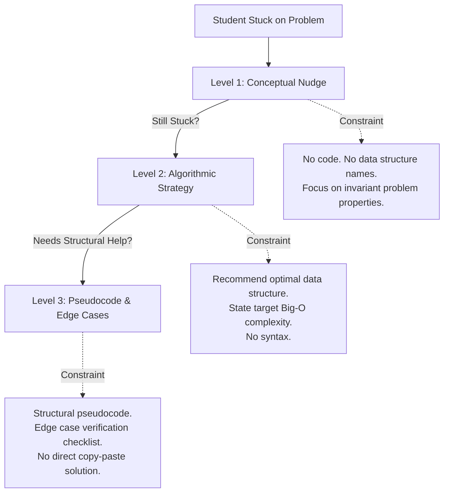
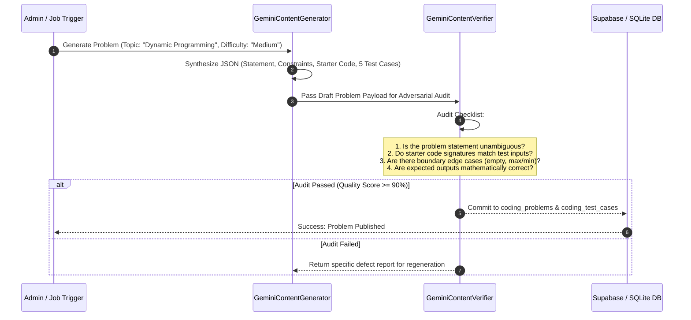

# Cognitio Libera — Google Gemini AI Engine 🧠

> **Practice. Understand. Improve.**  
> Technical architecture of AI tutoring, progressive hints, code reviews, and synthetic content dual-verification.

---

## 1. Architectural Boundary: AI vs. Deterministic Sandbox

A core architectural tenet of Cognitio Libera is the **strict separation of concerns**:
- **Code Correctness & Grading**: Handled **exclusively** by the sandboxed execution engine (**Judge0**). LLMs frequently hallucinate execution paths, miss subtle off-by-one errors, or falsely pass failing tests.
- **Pedagogy, Mentorship & Content Synthesis**: Handled **exclusively** by **Google Gemini** (`gemini-2.5-flash` / `gemini-2.5-pro`).

```
                ┌───────────────────────────────┐
                │        STUDENT ATTEMPT        │
                └───────────────┬───────────────┘
                                │
        ┌───────────────────────┴───────────────────────┐
        ▼                                               ▼
┌───────────────────────────────┐       ┌───────────────────────────────┐
│     JUDGE0 SANDBOX ENGINE     │       │    GOOGLE GEMINI AI ENGINE    │
├───────────────────────────────┤       ├───────────────────────────────┤
│ • Deterministic test runs     │       │ • Progressive pedagogical hints│
│ • Execution metrics (ms, KB)  │       │ • Structural code review      │
│ • Memory & time limit defense │       │ • Socratic interactive chat   │
│ • Strict Pass / Fail verdict  │       │ • Content generation & audit  │
└───────────────────────────────┘       └───────────────────────────────┘
```

---

## 2. AI Mentor: Progressive Hint Architecture

Cognitio Libera does not dump full solutions on students when they get stuck. Instead, it implements a **3-tier progressive hint hierarchy** in `backend/app/ai/mentor.py`:



### Prompt Engineering Guidelines:

#### Level 1: Conceptual Nudge
```
System: You are an expert computer science tutor. The student is trying to solve: {title}.
Current student code:
{code}

Provide a Level 1 Hint: A gentle conceptual nudge.
RULES:
1. Do NOT mention specific algorithm names (e.g. 'Two Pointers', 'Kadane's') or data structure names.
2. Ask a thought-provoking question about an invariant or pattern in the input.
3. Keep it under 3 sentences.
```

#### Level 2: Algorithmic Strategy
```
System: Provide a Level 2 Hint: Algorithmic Strategy.
RULES:
1. Explain the optimal theoretical approach and the recommended data structure.
2. State the expected target Time and Space complexity (e.g., O(N) time and O(N) auxiliary space).
3. Do NOT provide syntax or code blocks in any programming language.
```

#### Level 3: Structural Pseudocode & Edge Cases
```
System: Provide a Level 3 Hint: Structural Pseudocode & Edge Cases.
RULES:
1. Provide step-by-step structural pseudocode.
2. Highlight at least 2 critical edge cases the student must guard against.
3. Do NOT provide direct copy-pasteable code in the student's target language.
```

---

## 3. Structured Code Review Engine

When a student requests a review (`POST /api/v1/mentor/review`), Gemini evaluates their solution along four distinct dimensions:

1. **Time Complexity Analysis**: Big-O derivation of loops, recursion, and library calls.
2. **Space Complexity Analysis**: Auxiliary memory and heap allocation audit.
3. **Code Quality & Idiomatic Style**: Variable naming, conciseness, and language-idiomatic idioms.
4. **Edge Cases & Vulnerabilities**: Potential runtime exceptions (integer overflow, null pointers, empty collections).

---

## 4. Content Generation & Dual-Verification Pipeline

To expand the platform's question bank, Cognitio Libera employs a dual-agent generation and verification pattern (`backend/app/ai/verifier.py` & `generator.py`):



---

## 5. Model Configuration & Parameters

Configured in `backend/app/core/config.py`:
- **Model Family**: `gemini-2.5-flash` (low-latency hints & chat), `gemini-2.5-pro` (deep code review & content verification).
- **Temperature Settings**:
  - `0.2 - 0.3`: For hints, code reviews, and structured JSON generation (high determinism).
  - `0.6`: For interactive Socratic conversation.
- **Environment Key**: `GEMINI_API_KEY` obtained from Google AI Studio.
